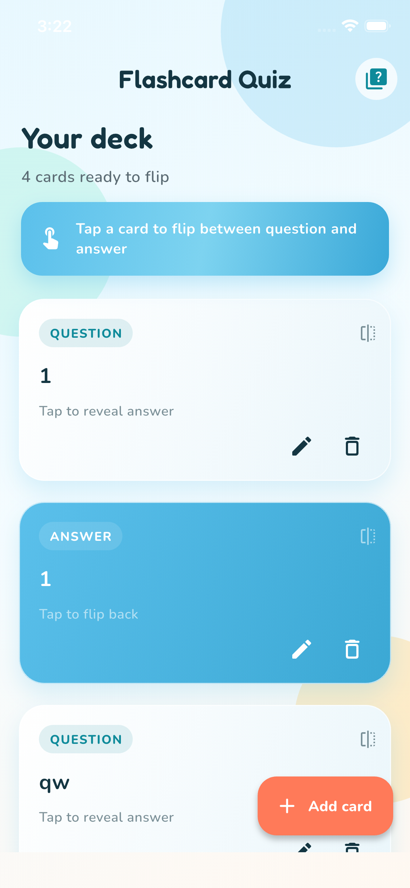
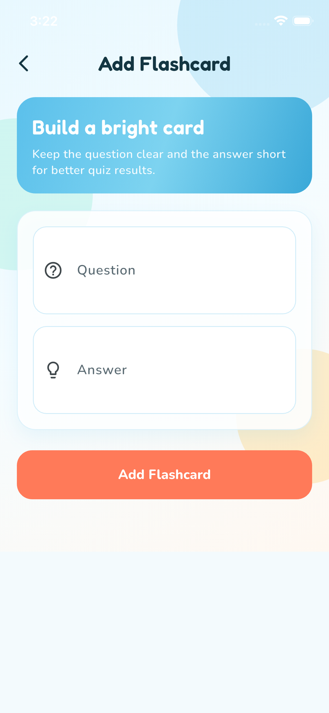
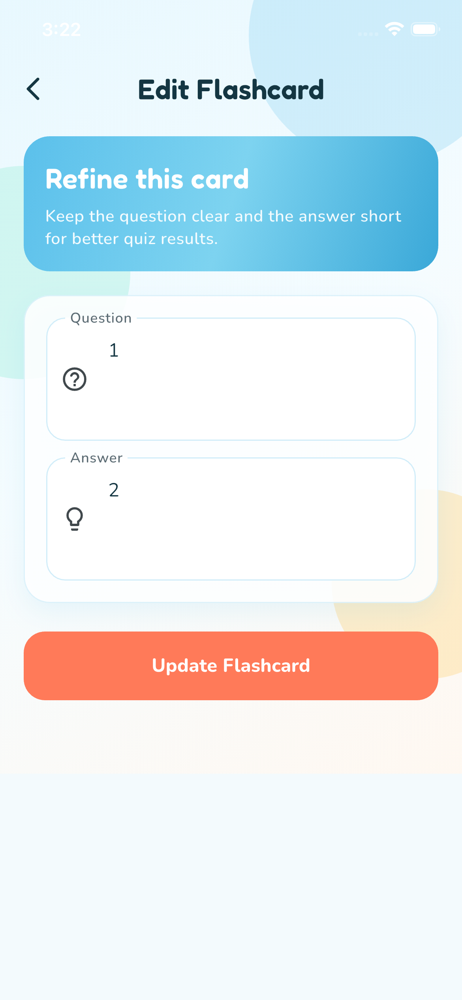
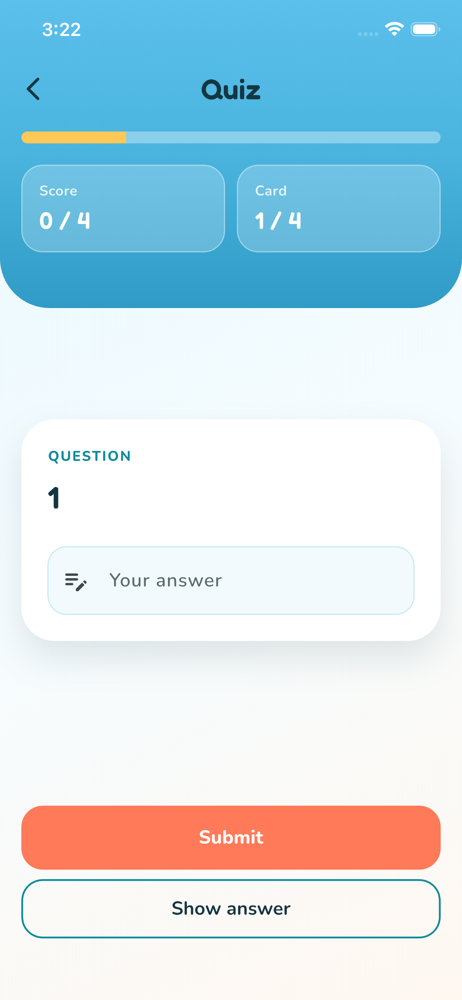

# Flashcard Quiz

A Flutter portfolio app for creating flashcards, flipping through them, and taking a typed-answer quiz. Cards are stored in Cloud Firestore.

**Started:** June 2024

## Screenshots

<p align="center">
  
  &nbsp;
  
  &nbsp;
  
  &nbsp;
  
</p>

| Home | Add card | Edit card | Quiz |
| --- | --- | --- | --- |
| Deck list with flip cards | Create a new flashcard | Update question & answer | Typed-answer quiz mode |

## Features

- Create, edit, and delete flashcards
- Flip cards to review questions and answers
- Quiz mode with score tracking and review of missed answers
- Loading, empty, and error states for network failures
- Pull-to-refresh on the card list

## Architecture

Small and intentional:

- `Provider` + `ChangeNotifier` for app state
- Firestore collection `flashcards` for persistence
- Screens for list, form, and quiz
- Reusable flip-card widget

No extra layers or packages beyond what the app needs.

## Setup

1. Install Flutter (3.2+ / Dart 3.2+)
2. Configure Firebase for your platforms (FlutterFire already scaffolds `lib/firebase_options.dart` and Android `google-services.json`)
3. Ensure Firestore has a `flashcards` collection (documents with `question` and `answer` string fields)
4. Run:

```bash
flutter pub get
flutter run
```

## Project structure

```text
lib/
  main.dart
  firebase_options.dart
  data/flashcard_data.dart
  models/flashcard.dart
  screens/
  theme/
  widgets/
assets/
  images/
```

## Tests

```bash
flutter analyze
flutter test
```
